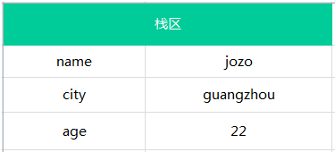
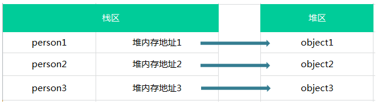
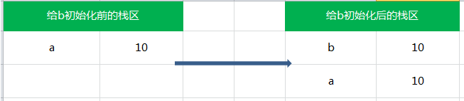
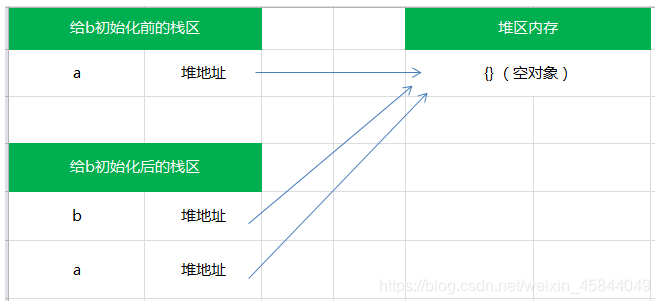

# 基本数据类型和应用类型

本系列是我个人整理的JavaScript深入系列。

## JS的变量存储类型

变量存储类型分两类

1. 基本类型：直接存储在**栈**中的数据。（**字符串、布尔值、数字、undefined、null**）
2. 引用类型：将该对象引用地址存储在**栈**中，然后对象里面的数据存放在**堆**中。（**数组、对象、Date、RegExp、函数**、特殊的基本包装类型以及单体内置对象）

特殊的基本包装类型(String、Number、Boolean)以及单体内置对象(Global、Math)

### 1.基本类型的变量是存放在栈区的（内存里的栈内存）

假如有以下几个基本类型的变量：

```js
var name = 'jozo';
var city = 'guangzhou';
var age = 22;
```

那么它的存储结构如下图：



栈区包括了 变量的标识符和变量的值。

## 2. 引用类型的变量将对象引用地址存储在栈中，对象里面的数据存放在堆中

JavaScript 和其他语言不同，其不允许直接访问内存中的位置，也就是说不能直接操作对象的内存空间，那我们操作啥呢？ 实际上，是操作对象的引用，所以引用类型的值是按引用访问的。

准确地说，引用类型的存储需要内存的栈区和堆区（堆区是指内存里的堆内存）共同完成，栈区内存保存变量标识符和指向堆内存中该对象的指针，也可以说是该对象在堆内存的地址。

假如有以下几个对象：

```js
var person1 = {name:'jozo'};
var person2 = {name:'xiaom'};
var person3 = {name:'xiaoq'};
```

则这三个对象的在内存中保存的情况如下图：



## 3. 简单赋值

在从一个变量向另一个变量赋值基本类型时，会在该变量上创建一个新值，然后再把该值复制到为新变量分配的位置上：

```js
var a = 10;
var b = a;

a ++ ;
console.log(a); // 11
console.log(b); // 10
```

此时，a中保存的值为 10 ，当使用 a 来初始化 b 时，b 中保存的值也为10，但b中的10与a中的是完全独立的，该值只是a中的值的一个副本，此后，这两个变量可以参加任何操作而相互不受影响。



**也就是说基本类型在赋值操作后，两个变量是相互不受影响的。**

## 4. 对象引用

当从一个变量向另一个变量赋值引用类型的值时，同样也会将存储在变量中的对象的值复制一份放到为新变量分配的空间中。前面讲引用类型的时候提到，保存在变量中的是对象在堆内存中的地址，所以，与简单赋值不同，这个值的副本实际上是一个指针，而这个指针指向存储在堆内存的一个对象。那么赋值操作后，两个变量都保存了同一个对象地址，则这两个变量指向了同一个对象。因此，改变其中任何一个变量，都会相互影响：

```js
var a = {}; // a保存了一个空对象的实例
var b = a;  // a和b都指向了这个空对象

a.name = 'jozo';
console.log(a.name); // 'jozo'
console.log(b.name); // 'jozo'

b.age = 22;
console.log(b.age);// 22
console.log(a.age);// 22

console.log(a == b);// true
```

它们的关系如下图：



**因此，引用类型的赋值其实是对象保存在栈区地址指针的赋值，因此两个变量指向同一个对象，任何的操作都会相互影响。**

# 深拷贝和浅拷贝

最后再来看深拷贝和浅拷贝还有赋值的区别，这样就好理解多了

**浅拷贝**：也就是拷贝A对象里面的数据，但是不拷贝A对象里面的子对象

**深拷贝**：会克隆出一个对象，数据相同，但是引用地址不同（就是拷贝A对象里面的数据，而且拷贝它里面的子对象）

**赋值**：简单赋值和对象引用，对象引用获得该对象的引用地址

# 记一个最简单的对象深拷贝，解决文章例子中的问题

一个最简单的对象深拷贝：

```js
var obj = {
name : 'zhl',
age : 30
}

var obj2 = JSON.parse(JSON.stringify(obj));
```

**所以文章例子中的问题写一个这样简单的深拷贝就可以解决了：**

```js
this.addressModel = JSON.parse(JSON.stringify(this.address));
```


