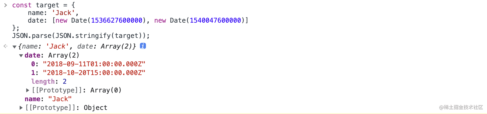
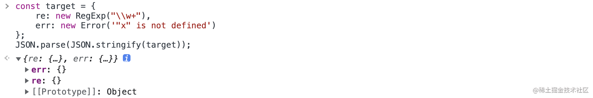
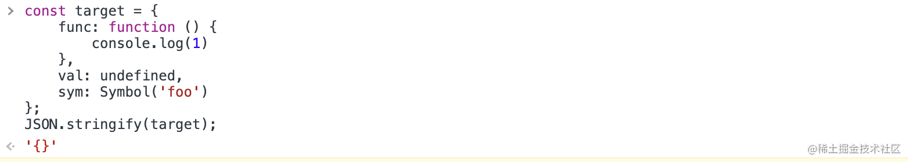
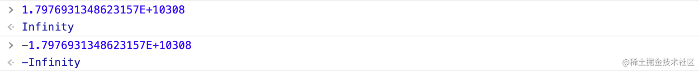
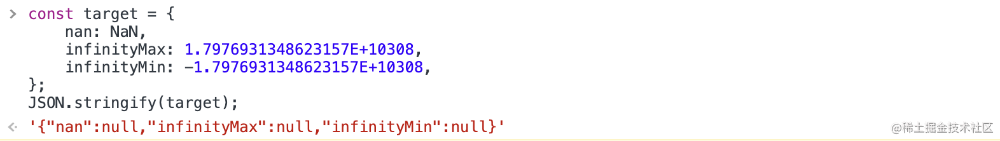
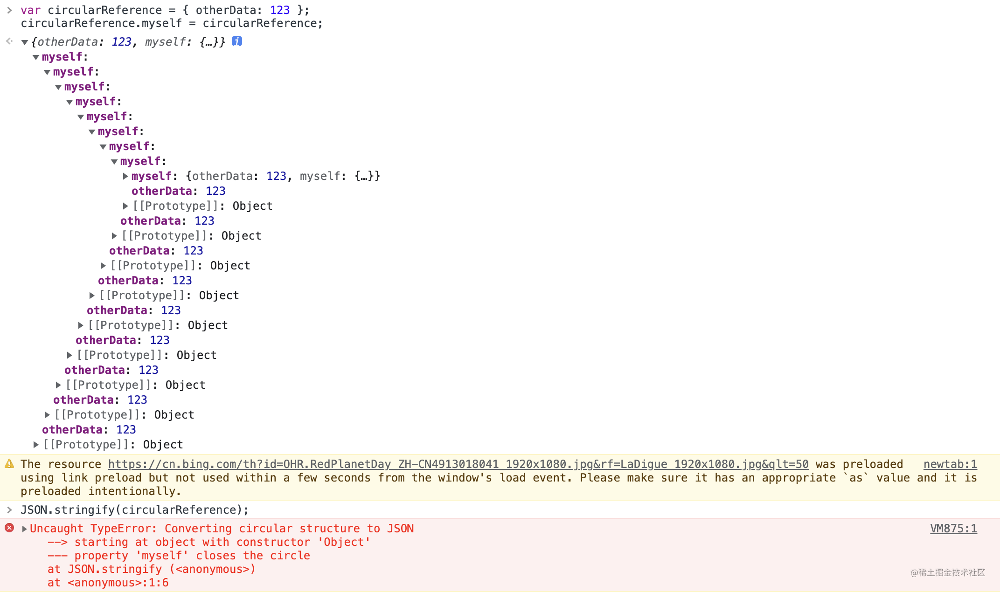

# 深拷贝

## 一、JSON.parse(JSON.stringify())

在不使用第三方库的情况下，想要深拷贝一个对象，一般来讲最简单的用的最多的就是 `JSON.parse(JSON.stringify(obj))`，其过程说白了就是利用 `JSON.stringify` 将 JS 对象序列化（JSON字符串），再使用 `JSON.parse` 来反序列化(还原) JS 对象。

```js
JSON.parse(JSON.stringify(obj));
```

这种写法非常简单，而且可以应对大部分的应用场景，但注意 JSON 只能用来序列化对象、数组、数值、字符串、布尔值和 `null`，依靠 JSON 深拷贝时存在很大缺陷，原因在于 `JSON.stringify()` 在序列化时会有以下问题：

1、时间对象序列化后会变成字符串；

```js
const target = {
    name: 'Jack',
    date: [new Date(1536627600000), new Date(1540047600000)]
};
JSON.parse(JSON.stringify(target));
```



> Date 日期调用了 toJSON() 将其转换为了 string 字符串（同 Date.toISOString()），因此会被当做字符串处理。

```js
JSON.stringify(new Date(1536627600000));
// '"2018-09-11T01:00:00.000Z"'
```

2、RegExp、Error 对象序列化后将只得到空对象；

```js
const target = {
    re: new RegExp("\\w+"),
    err: new Error('"x" is not defined')
};
JSON.stringify(target);
// '{"re":{},"err":{}}'
```



3、任意的函数、`undefined` 以及 symbol 值，在序列化过程中会被忽略；

```js
const target = {
    func: function () {
        console.log(1)
    },
    val: undefined,
    sym: Symbol('foo')
};
JSON.stringify(target);
// '{}'
```



4、NaN 和 Infinity 格式的数值都会被当做 null；

- `1.7976931348623157E+10308` 是浮点数的最大上限 显示为 Infinity
- `-1.7976931348623157E+10308` 是浮点数的最小下限 显示为 -Infinity

[](https://user-images.githubusercontent.com/93993961/204478982-30468b99-5aab-4f1f-a1e2-edec609ba7f9.png)

```
const target = {
    nan: NaN,
    infinityMax: 1.7976931348623157E+10308,
    infinityMin: -1.7976931348623157E+10308,
};
JSON.stringify(target);
// '{"nan":null,"infinityMax":null,"infinityMin":null}'
```

[](https://user-images.githubusercontent.com/93993961/204479012-45e67678-35ff-4fcf-97a3-e654b59f5137.png)

5、对包含循环引用的对象（对象之间相互引用，形成无限循环）序列化，会抛出错误。

```js
var circularReference = { otherData: 123 };
circularReference.myself = circularReference;
JSON.stringify(circularReference);
// TypeError: cyclic object value(Firefox) 或 Uncaught TypeError: Converting circular structure to JSON(Chrome and Opera)
```

[](https://user-images.githubusercontent.com/93993961/204479048-6a4acd7b-76ea-462b-8bad-6cb1befbc0c3.png)

> 在 JSON 中出现循环引用时，JavaScript 会抛出 "cyclic object value" 的异常。`JSON.stringify()` 并不会尝试解决这个问题，因此导致运行失败。
>
> - 提示信息:
> - TypeError: cyclic object value (Firefox)
> - TypeError: Converting circular structure to JSON (Chrome and Opera)
> - TypeError: Circular reference in value argument not supported (Edge)

# 二、深拷贝

通过递归实现深拷贝：

```js
function deepClone(obj) { // 递归拷贝
    if (typeof obj !== 'object' || obj === null) return obj; // 如果不是复杂数据类型 或者为null，直接返回
    if (obj instanceof RegExp) return new RegExp(obj);
    if (obj instanceof Date) return new Date(obj);
    let cloneObj = Array.isArray(obj) ? [] : {};
    for (let key in obj) {
        // 判断是否是对象自身的属性，筛掉对象原型链上继承的属性
        if (obj.hasOwnProperty(key)) {
            // 如果 obj[key] 是复杂数据类型，递归
            cloneObj[key] = deepClone(obj[key]);
        }
    }
    return cloneObj;
}
```

我们应该拷贝要拷贝对象自身的属性，对象原型上的属性我们不应该拷贝，这里我们用到 `hasOwnProperty()` 方法来解决。

**`hasOwnProperty()` 方法会返回一个布尔值，这个方法可以用来检测一个对象是否含有特定的自身属性；该方法会忽略掉那些从原型链上继承到的属性。**

## 1. 循环引用

循环引用会使递归进入死循环导致栈内存溢出。

我们拷贝一下前面循环引用的例子：

```js
var circularReference = { otherData: 123 };
circularReference.myself = circularReference;
deepClone(circularReference);
// Uncaught RangeError: Maximum call stack size exceeded 超出最大调用堆栈大小
```

解决循环引用问题，可以额外开辟一个存储空间，来存储当前对象和拷贝对象的对应关系，当需要拷贝当前对象时，先去存储空间中找，有没有拷贝过这个对象，如果有的话直接返回，如果没有的话继续拷贝，这样就巧妙化解的循环引用的问题。

这个存储空间，需要可以存储 `key-value` 形式的数据，且 **`key` 可以是一个引用类型**，我们可以选择 `Map` 这种数据结构：

- 检查 `map` 中有无克隆过的对象
- 有 - 直接返回
- 没有 - 将当前对象作为 `key`，克隆对象作为 `value` 进行存储
- 继续克隆

```js
function deepClone(obj, map = new Map()) { // 递归拷贝
    if (typeof obj !== 'object' || obj === null) return obj; // 如果不是复杂数据类型 或者为null，直接返回
    if (obj instanceof RegExp) return new RegExp(obj);
    if (obj instanceof Date) return new Date(obj);
    if (map.has(obj)) return map.get(obj);
    let cloneObj = Array.isArray(obj) ? [] : {};
    map.set(obj, cloneObj);
    for (let key in obj) {
        // 判断是否是对象自身的属性，筛掉对象原型链上继承的属性
        if (obj.hasOwnProperty(key)) {
            // 如果 obj[key] 是复杂数据类型，递归
            cloneObj[key] = deepClone(obj[key], map);
        }
    }
    return cloneObj;
}
```

再次执行前面的用例可以发现没有报错，循环引用的问题解决了。

## 2. 使用 WeakMap 优化

下面我们用 `WeakMap` 替代 `Map` 来优化深拷贝的实现。

如下：

```js
function deepClone(obj, map = new WeakMap()) {
    // ...
};
```

为什么要这样做呢？先来看看 `WeakMap` 的作用：

> WeakMap 对象是一组键/值对的集合，其中的键是弱引用的。其键必须是对象，而值可以是任意的。

什么是弱引用呢？

> 在计算机程序设计中，弱引用与强引用相对，是指不能确保其引用的对象不会被垃圾回收器回收的引用。 一个对象若只被弱引用所引用，则被认为是不可访问（或弱可访问）的，并因此可能在任何时刻被回收。

我们默认创建一个对象：`const obj = {}`，就默认创建了一个强引用的对象，我们只有手动将 `obj = null`，它才会被垃圾回收机制进行回收，如果是弱引用对象，垃圾回收机制会自动帮我们回收。

举个例子：

如果我们使用 `Map` 的话，那么对象间是存在强引用关系的：

```js
let obj = { name : 'Jack'}
const target = new Map();
target.set(obj,'person');
obj = null;
```

虽然我们手动将 `obj`，进行释放，然是 `target` 依然对 `obj` 存在强引用关系，所以这部分内存依然无法被释放。

再来看 `WeakMap`：

```js
let obj = { name : 'Jack'}
const target = new WeakMap();
target.set(obj,'person');
obj = null;
```

如果是 `WeakMap` 的话，`target` 和 `obj` 存在的就是弱引用关系，当下一次垃圾回收机制执行时，这块内存就会被释放掉。

设想一下，如果我们要拷贝的对象非常庞大时，使用 `Map` 会对内存造成非常大的额外消耗，而且我们需要手动清除 `Map` 的属性才能释放这块内存，而 `WeakMap` 会帮我们巧妙化解这个问题。

我也经常在某些代码中看到有人使用 `WeakMap` 来解决循环引用问题，但是解释都是模棱两可的，当你不太了解 `WeakMap` 的真正作用时。我建议你也不要在面试中写这样的代码，结果只能是给自己挖坑，即使是准备面试，你写的每一行代码也都是需要经过深思熟虑并且非常明白的。

能考虑到循环引用的问题，你已经向面试官展示了你考虑问题的全面性，如果还能用 `WeakMap` 解决问题，并很明确的向面试官解释这样做的目的，那么你的代码在面试官眼里应该算是合格了。

- 循环引用部分内容出自 `ConardLi大佬` [如何写出一个惊艳面试官的深拷贝?](https://link.juejin.cn/?target=https%3A%2F%2Fsegmentfault.com%2Fa%2F1190000020255831)。

## 三、lodash中的cloneDeep源码

